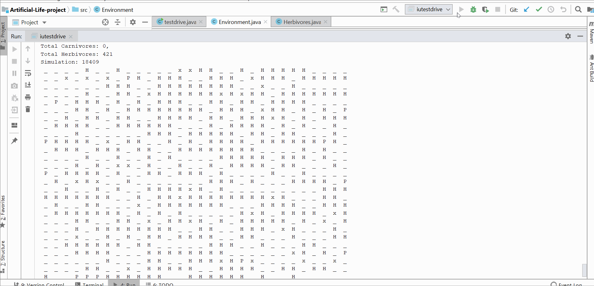

### Artificial Life Project

##### Description :

​	This project was a Software Design Lab assignment. It was given to teach java, inheritance and polymorphism concepts. The artificial environment containing plants, carnivores and herbivores. The plants would grow and die of old age. The herbivores would eat the plants and die of old age or be killed by a carnivore. The carnivores would hunt the herbivores and die of old age or lack of food.

##### Objective:

​	Implement a self-sustaining artificial environment. 

##### Problems:

​	There needs to be a balance of plants, herbivores, and carnivores . If there's not enough plants; the herbivores would die off. If there's not enough herbivores; the carnivores would die off. If there's too much of one class, the entire environment fails. The plants, herbivores, and carnivores would also needs to reproduce at a rate that would not destroy the environment. 

##### Classes 

- A abstract class called agent. All classes Plants, Herbivores, and Carnivores are subclasses of this. 
- If you wanted it you can create new subclasses for Plants, Herbivores, and Carnivores and have these creatures live in the environment to see how they interact. This is the power of inheritance and polymorphism. 

##### Result

- My carnivores die out but the herbivores and plants are able to sustain themselves. I would need to adjust how fast they reproduce, age, and eat. 

